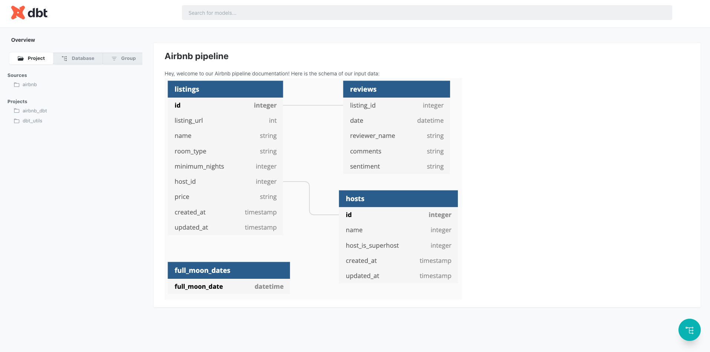
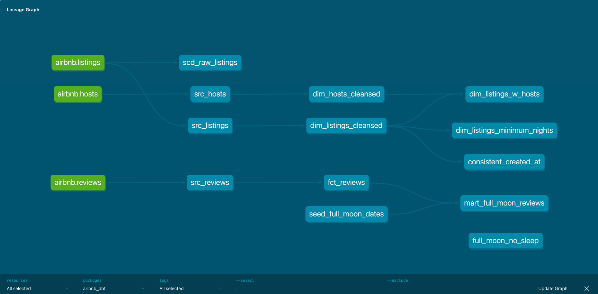

## Project Overview
This project is an end-to-end ELT pipeline built with dbt that ingests, cleans, and models the Airbnb dataset into a star-schema ready for analytics and BI. It focuses on transforming data using dbt with Snowflake as the data warehouse.

## Data Sources
Data is collected from a case study Airbnb from Amazon Web Services
Below is the schema for our raw Airbnb tables, as defined in our `sources:` block. 


## Lineage Graph



## Project Structure
```
Directory structure:
└── itsannhienjoy-airbnb-dbt/
    ├── README.md
    ├── dbt_project.yml
    ├── package-lock.yml
    ├── packages.yml
    ├── analyses/
    │   ├── full_moon_no_sleep.sql
    │   └── .gitkeep
    ├── macros/
    │   ├── no_nulls_in_columns.sql
    │   ├── positive_value.sql
    │   └── .gitkeep
    ├── models/
    │   ├── docs.md
    │   ├── overview.md
    │   ├── dim/
    │   │   ├── dim_hosts_cleansed.sql
    │   │   ├── dim_listings_cleansed.sql
    │   │   └── dim_listings_w_hosts.sql
    │   ├── fct/
    │   │   └── fct_reviews.sql
    │   ├── mart/
    │   │   └── mart_full_moon_reviews.sql
    │   ├── raw/
    │   │   └── sources.yml
    │   ├── src/
    │   │   ├── src_hosts.sql
    │   │   ├── src_listings.sql
    │   │   └── src_reviews.sql
    │   └── test/
    │       └── schema.yml
    ├── seeds/
    │   ├── seed_full_moon_dates.csv
    │   └── .gitkeep
    ├── snapshots/
    │   ├── scd_raw_listings.sql
    │   └── .gitkeep
    └── tests/
        ├── consistent_created_at.sql
        ├── dim_listings_minimum_nights.sql
        └── .gitkeep
```
## Prerequisites

- Python: ≥ 3.8

- dbt: 1.9.4 (dbt-core, dbt-snowflake, dbt-utils)

- Data warehouse: Snowflake

- Profiles: create ~/.dbt/profiles.yml with a airbnb_dbt target pointing at your Snowflake (or other) credentials.

## Installation 

```
git clone https://github.com/itsannhienjoy/airbnb-dbt.git
cd airbnb-dbt

pip install dbt-core dbt-snowflake dbt-utils
dbt deps

dbt seed
dbt run
dbt test
```